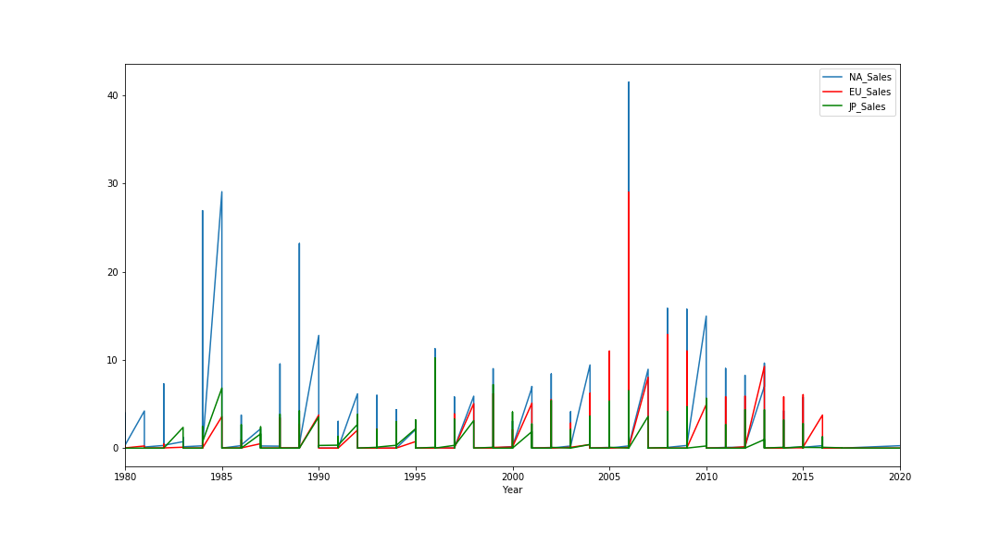
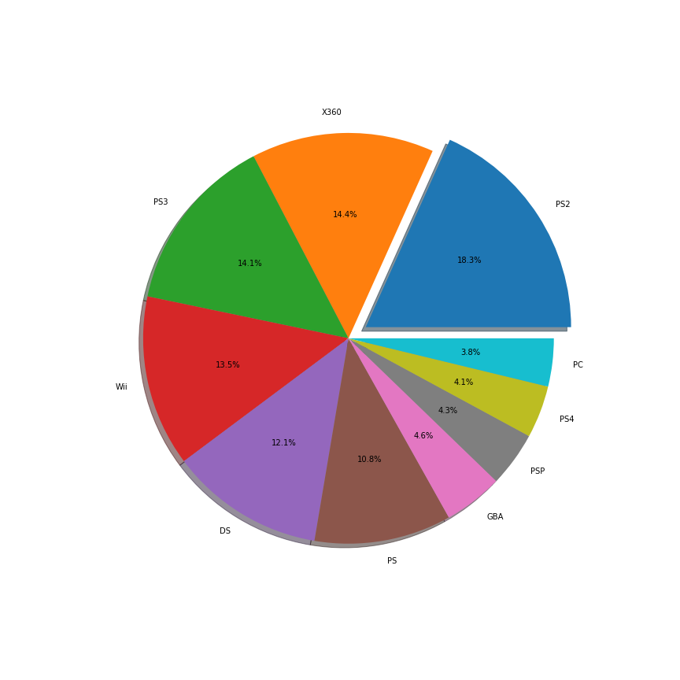
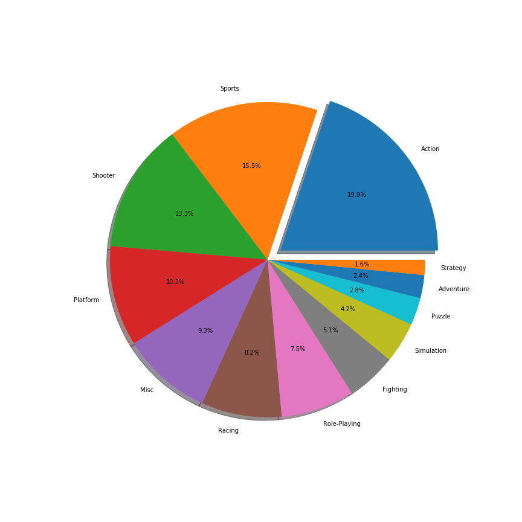
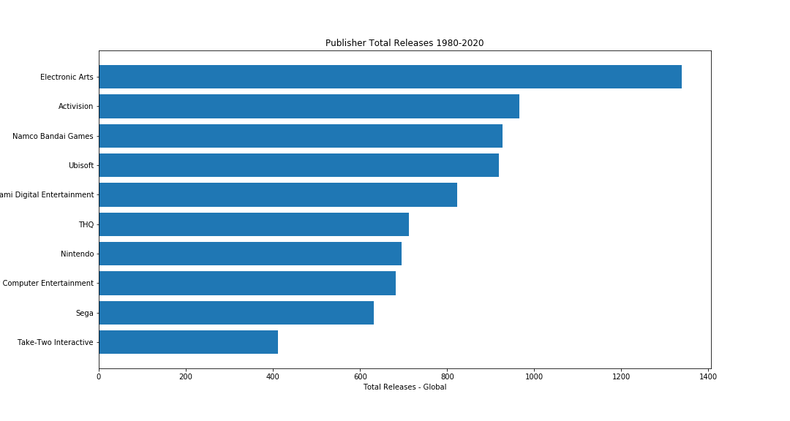

# Data Analysis: Video Game Sales - Python / SQL Project

Check out my website for more projects! --> http://gianmillare.io/

Welcome to my Video Game Sales Data Analysis Project! It is currently Sunday and I don't have much to do. So to rid myself of boredom, I decided to analyze random data. My friends and I are gamers, so I decided to analyze data on video games. In this project, I'll answer questions like "which consoles is the most successful", "which console is the most active", "which console is most successful in specific regions", and many more. Enjoy!

------------------------------------------------------------------------------------------------------------------------
There are 7 Challenges in total in this Data Project. Each challenge answers a question that a client or a potential employer may ask about the data set. Some of the Challenges answer multiple questions or can answer other questions. Obviously, their are endless amounts of questions that can be asked, but I attempted to answer the questions I felt were paramount.

------------------------------------------------------------------------------------------------------------------------

## Below is a preview of the analysis:

### Change in sales from 1980-2020

------------------------------------------------------------------------------------------------------------------------

### Establishing the top ten consoles based on copies sold

------------------------------------------------------------------------------------------------------------------------

### Analyzing the Genre's of specific regions

------------------------------------------------------------------------------------------------------------------------

### Analyzing the Publishers popularity

